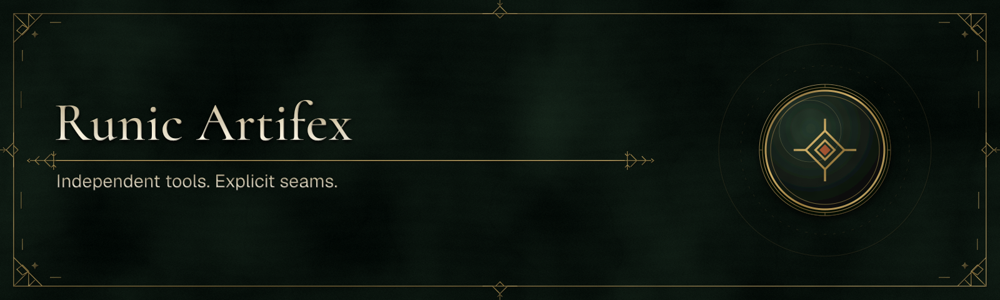

# Runic Svelte

Svelte 5 and SvelteKit integrations owned by the Svelte side of the Runic
Artifex ecosystem.

| Package | Purpose |
|---|---|
| `@runic-artifex/svelte` | Runes-based Application Bridge state, typed context, and opt-in Effect workflows |
| `@runic-artifex/sveltekit` | Static/native SvelteKit adapter and deterministic host manifest |

Only Svelte 5 is supported. There is no Svelte 4 build, legacy-store adapter,
or renderer-owned protocol runtime.

Runic Flow, when an application uses it, remains a headless host implementation
detail. Its state is exposed through the application's named Application Bridge
snapshot and events, so these Svelte packages do not create a Flow runtime or a
second protocol. Svelte owns rune projection and component-tree lifecycle;
SvelteKit continues to own URLs, browser history, routing, and page state.
